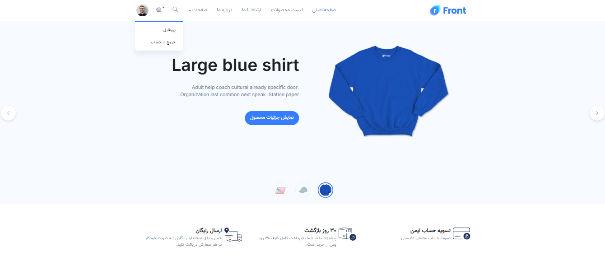
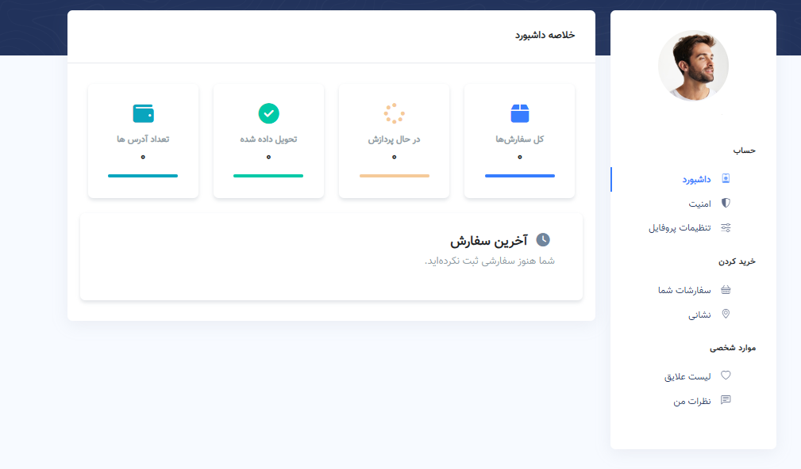
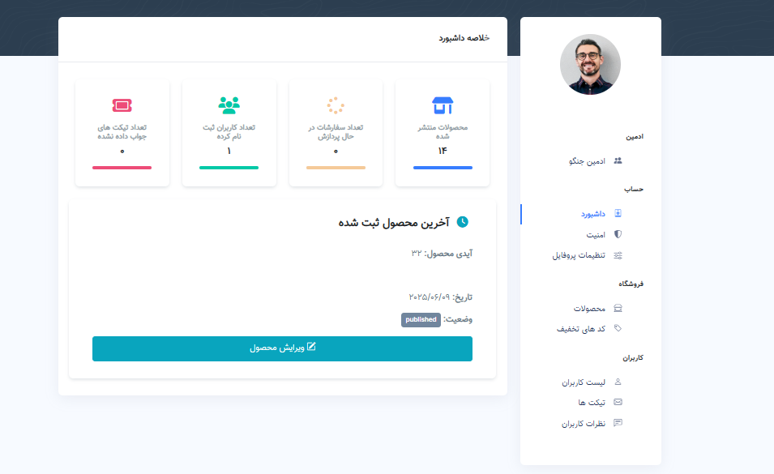

<h1 align="center">Django TestShop</h1>
<h3 align="center">A Sample shop for educational purposes and use for template </h3>
<p align="center">

</p>
 
# Guideline
- [Guideline](#guideline)
- [Goal](#goal)
- [Demo](#demo)
- [Setup](#setup)
- [Getting ready](#getting-ready)
- [Curriculum](#curriculum)
- [License](#license)
- [Bugs](#bugs)


# Goal

This is a sample project to show you how to create a ecommerce website, and how to interact with users and payment gateway and also how to manage orders and products.

# Demo

the photos will show you a demo of the project 

<p align="center">
<h3 align="center">Main Page </h3>


<h3 align="center">Customer Dashboard</h3>


<h3 align="center">Admin Dashboard</h3>


</p>


### Setup
To get this repository, run the following command inside your git enabled terminal
```bash
git clone https://github.com/rms82/django-mk-shop-withoutDocker
```

### Getting ready
Create an enviroment in order to keep the repo dependencies seperated from your local machine.
```bash
python -m venv venv
```

Make sure to install the dependencies of the project through the requirements.txt file.
```bash
pip install -r requirements.txt
```

Once you have installed django and other packages, go to the cloned repo directory and run the following command

```bash
python manage.py makemigrations
```

This will create all the migrations file (database migrations) required to run this App.

Now, to apply this migrations run the following command
```bash
python manage.py migrate
```

# Curriculum

here are the course main curriculum

- introduction (phase 1)
- project setup
- authentication and authorization
- create shop and products
- manage and create cart
- users dashboard based and pages
- product and inventory management
- session and db management of cart
- order and total price calculation
- integration with payment gateway
- order management
- wishlist management
- review management


# License
MIT.


# Bugs
Feel free to let me know if something needs to be fixed. or even any features seems to be needed in this repo.
